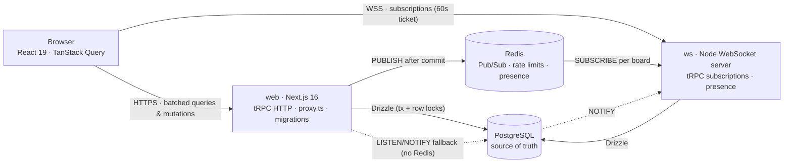

# Syncra

**Real-time, multiplayer Kanban engineered like infrastructure.**

Syncra is an ephemeral, multiplayer planning board for engineering teams: one click provisions an isolated workspace, and one shared link seats a colleague in it, with no account required. Every drag, new card and presence change streams to everyone in the room in real time. Underneath is a production-grade TypeScript stack that is typed end to end, from the Postgres schema to the pixel.

`Next.js 16` · `React 19` · `tRPC 11` · `TanStack Query 5` · `Drizzle ORM` · `PostgreSQL` · `Redis` · `WebSockets` · `Zod 4` · `Tailwind CSS 4` · `TypeScript (strict, zero any)`

---

## Architecture at a glance



Mutations run in the Next.js process and subscriptions in a dedicated WebSocket process. The two are bridged by an event bus that runs on Redis when it's available and falls back to PostgreSQL otherwise.

---

## Technical highlights

### 1. End-to-end type safety

- **One contract, zero codegen.** The client imports only `type AppRouter`. tRPC 11 infers every procedure's input and output straight from the Drizzle schema, so renaming a column breaks the build in every component that reads it.
- **Split transport.** A `splitLink` sends queries and mutations over batched HTTP and subscriptions over a single multiplexed WebSocket. Subscriptions are tRPC `observable` streams; `superjson` preserves `Date`s on both transports.
- **Zod at every trust boundary**, not just procedure inputs:
  - environment variables, validated once at boot;
  - JWT claims (sessions and WebSocket tickets);
  - every event coming off the wire (Redis messages and Postgres `NOTIFY` payloads are untrusted input);
  - Redis Lua script replies;
  - route query strings.
- **Strict compiler settings**: `strict`, `noUncheckedIndexedAccess`, `verbatimModuleSyntax` and `useUnknownInCatchVariables`. There are no `any` types anywhere in the codebase.
- **Authorization lives in the type system.** Scoped procedure builders (`workspaceProcedure`, `boardProcedure`, `columnProcedure`, `taskProcedure`) declare the id they need and resolve it to a workspace membership in one query. They then expose a typed `ctx.access`, so a resolver built on them cannot skip the tenant check.

### 2. O(1) fractional indexing

- **One row per move.** `position` is a base-62 lexicographic key (`a0 < a0V < a1`) with a variable-length integer head. Appends stay O(log n) in key length, and a move writes exactly one row, never a renumbering cascade across the column.
- **Byte-wise ordering everywhere.** The column is declared `text COLLATE "C"`. With a locale collation, SQL `ORDER BY` and JavaScript `<` could disagree about order. A `UNIQUE (column_id, position)` index serves both the sort and the neighbour lookups as index seeks.
- **Server-authoritative intent.** Clients send `{ toColumnId, afterTaskId }`, not a key. Inside one transaction the server:
  1. locks the destination column row (`SELECT … FOR UPDATE`), which serializes concurrent writers into the same gap;
  2. reads the anchor and its current successor;
  3. derives the key and commits.

  Lock order is always column, then task, which makes it deadlock-free by construction. Unique, serialization and deadlock violations (`23505`, `40001`, `40P01`) map to a typed `CONFLICT`.
- **Events only after commit.** Nothing is ever broadcast for a write that rolled back.
- **Verified by a fuzz test.** 5,000 random drag-and-drop operations run without a single ordering violation.

### 3. Advanced optimistic UI

- **Cancel, then write.** `onMutate` cancels in-flight board fetches *before* writing to the cache. A cancelled query reverts to its pre-fetch state, so reversing that order would silently wipe the optimistic update.
- **Predict, then reconcile.** The client computes the same fractional key the server will, so the card lands in its final slot before the round-trip. On success, the server's authoritative key replaces the prediction.
- **Atomic, per-item rollback.** If a move fails while it's the only one in flight, the full snapshot is restored. If other moves are still in flight, only the failed task is reverted, so card A's failure never undoes card B. The board is resynced once, when the last concurrent mutation settles.
- **Realtime reconciliation:**
  - per-tab `clientId`s suppress each tab's own echo;
  - last-writer-wins on the row's `updatedAt` drops out-of-order events;
  - a refetch on reconnect fills the gap left by Pub/Sub's lack of replay.
- **Jank-free drag and drop:**
  - Cards use two layers. The library owns the outer transform; transitions live only on the inner element.
  - Cards are spaced with margins, not `gap`, because the library measures margin boxes.
  - TanStack's notifier runs on a microtask, so the reordered list paints in the same frame as the drop.
- **Optimistic create.** New cards appear instantly with a temporary id, and dragging is disabled until the server confirms them.

### 4. Hybrid network event bus

- **One typed interface, two transports:**
  - **Redis Pub/Sub for scale.** Channels are per board. `SUBSCRIBE`s are reference-counted per process, so any number of viewers costs one Redis subscription per board per node.
  - **PostgreSQL `LISTEN/NOTIFY` as the zero-infrastructure fallback.** Each process holds a single `LISTEN` on one channel and demultiplexes locally; envelopes stay far below the 8 KB `NOTIFY` limit. Local development and small deployments need nothing beyond the database.
- **Presence follows the same pattern.** It's stored in a Redis hash or a Postgres table, keyed per *connection* and collapsed per user, so two tabs count as one avatar showing "2 tabs".
- **Fast clean-up:**
  - The WebSocket keep-alive (5s ping, 5s pong wait) drops a silent client in 10s or less.
  - A 4s heartbeat with a 10s TTL expires connections orphaned by a crashed node in about 14s.

### Also worth a look

- **Demo rooms as isolated tenants:**
  - One transaction provisions a workspace, a board, six persona users, memberships and seats.
  - Seats are assigned under a room row lock with a 90-second lease, so concurrent joiners never receive the same identity.
  - A signed, HttpOnly session locks each visitor to their room's workspace, and every procedure enforces that lock on top of membership.
- **WebSocket handshake guard.** The server owns the HTTP upgrade and checks, cheapest first:
  1. the Origin allow-list, which blocks cross-site WebSocket hijacking;
  2. a per-IP token bucket;
  3. a 60-second, audience-scoped ticket;
  4. that the user still exists;
  5. that the demo room is still live;
  6. a per-user connection cap.

  A rejected client gets a plain HTTP 4xx and never receives a socket.
- **Rate limiting.** A token bucket runs as an atomic Lua script on Redis's clock, or in-process as a memory-bounded LRU when Redis is absent. Limited requests get `429` with `Retry-After` and a typed `retryAfterMs`.
- **Next.js 16 `proxy.ts`.** A stateless JWT gate keeps navigation checks free of database round-trips.

---

## Quick start (local sandbox)

**Prerequisites:** Node.js 22 and PostgreSQL 15 or newer (tested on 16). Redis is optional.

```bash
# 1. Install
npm install

# 2. Configure
cp .env.example .env
#    Set AUTH_SECRET to 32+ random characters, e.g.:
node -e "console.log(require('crypto').randomBytes(48).toString('base64'))"

# 3. Create the database named in DATABASE_URL (default: matrix)
createdb matrix        # or: psql -U postgres -c "CREATE DATABASE matrix;"

# 4. Apply migrations
npm run db:migrate

# 5. Run Next.js (:3000) and the WebSocket server (:3001) together
npm run dev
```

**Try the multiplayer preview:**

1. Open <http://localhost:3000> and click **Create Live Demo Room**. You're seated as Alice.
2. Click **Share session** in the header to copy the invite link.
3. Open the link in a second browser or a private window. You join the same room as Bruno.
4. Drag a card in one window and watch it move in the other. Presence avatars, new cards and moves all sync live.

**Optional:**

```bash
npm run db:seed        # a persistent "Syncra" workspace with 3 boards + dev login links
npm run typecheck      # strict tsc, zero errors
npm test               # unit + fuzz tests
TEST_REDIS_URL=redis://localhost:6379 npm test   # also runs the Redis integration tests
```

Without `REDIS_URL`, realtime runs over Postgres `LISTEN/NOTIFY` and rate limiting runs in-process. Set `REDIS_URL` to exercise the distributed path.

---

## Production architecture

Deployed on **Railway** as two services built from the same repository, plus managed PostgreSQL and Redis.

| Service | Config | Build | Pre-deploy | Start | Healthcheck |
|---|---|---|---|---|---|
| `web` | `/railway/web.json` | `npm run build && npm run build:server` | `npm run db:migrate:prod` | `npm run start` (`next start` on `$PORT`) | `GET /api/health` |
| `ws` | `/railway/ws.json` | `npm run build:server` (esbuild bundle) | — | `npm run start:ws` (`node dist/ws.mjs` on `$PORT`) | `GET /health` |

- **Two processes, two services.** Each gets its own port, domain, healthcheck and restart policy. A frontend deploy never drops a socket, and a WebSocket crash never takes pages down.
- **Deep healthchecks.** Both endpoints return `200` only when Postgres (and Redis, if configured) respond. A mis-wired deploy never replaces a healthy one.
- **Zero-downtime WebSocket redeploys.** On `SIGTERM` the server returns `503` from `/health`, refuses new upgrades and tells clients to reconnect. Clients land on the new deployment with a fresh ticket.
- **Safe migrations.** They run as Railway's pre-deploy step with drizzle-orm's runtime migrator under a Postgres advisory lock. Concurrent deploys can't apply a migration twice, and a failed migration aborts the deploy.
- **Private networking.** Services talk to Postgres and Redis over Railway's private network (`*.railway.internal`). Redis connections use `family: 0` for dual-stack DNS, and the WebSocket server binds `::` with an IPv4 fallback.
- **Cross-site WebSockets.** The `web` and `ws` domains are different sites, so the session cookie can't reach the socket host. The browser exchanges its cookie for a 60-second, WebSocket-only ticket on every (re)connect.

Deployment files live in [`railway/`](railway). See `railway/web.env` and `railway/ws.env` for the exact production variables.

---

## Privacy & legal notice

Syncra is a portfolio demonstration. It is designed around data minimisation:

- **One functional cookie.** `matrix_session` is a signed, `HttpOnly`, `Secure`, `SameSite=Lax` session cookie that keeps you in your room. It is strictly necessary for the app to work and is not used for tracking.
- **No analytics, advertising or third-party trackers**, and nothing is shared with third parties.
- **No real identities.** Demo participants are fictional personas (Alice, Bruno, Chen…) with non-deliverable `.invalid` email addresses.
- **Transient IP processing.** IP addresses are used only for abuse prevention (rate limiting). They are held in memory, or in Redis keys that expire within minutes, and are never written to the database.
- **Ephemeral data.** A demo room and everything in it (workspace, boards, cards, personas, presence) is deleted automatically 24 hours after its last join. A clean-up job runs every 10 minutes, and deleting a room cascades through everything it owns. The sandbox may also be wiped at any time.
- **Treat rooms as public.** Anyone with a room link can join it, so don't enter sensitive or personal data.

The full **Privacy Policy** and **Terms of Service** are available in the app (footer, or `/#privacy` and `/#terms`).
